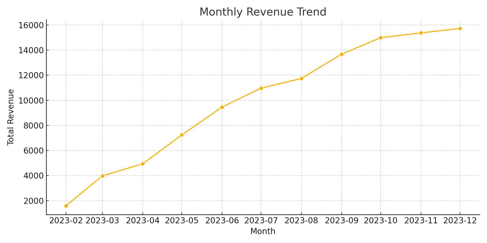
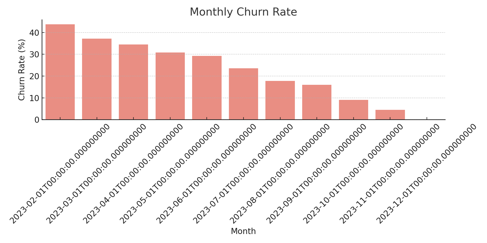

# SaaS Revenue & Churn Intelligence

This project simulates customer behavior in a subscription business and analyzes monthly revenue trends, churn patterns, and customer risk using Python and machine learning.

---

## Objective

- Analyze subscription revenue over time
- Track churn rates and forecast risk
- Predict churn likelihood based on usage and spend
- Provide actionable insights for retention and revenue planning

---

## Tools Used

- Python (Pandas, NumPy, Seaborn, Matplotlib)
- Random Forest (Scikit-learn)
- Jupyter Notebook
- Simulated time-series + customer behavior data

---

## Features

- Monthly revenue trend analysis  
- Monthly churn rate visualization  
- Churn prediction using usage & billing data  
- Confusion matrix & classification report output  

---

## Sample Visuals

### 1. Monthly Revenue Trend

### 2. Monthly Churn Rate

